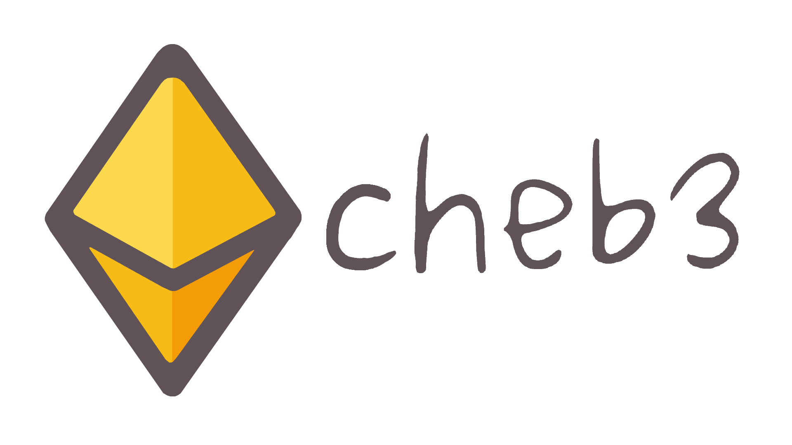

<p align="center" style="display: flex;">
    
    
</p>

<p align="center">🐣 web3 CTF tool based on web3.py</p>

<p align="center">
    <a href="https://cheb3.readthedocs.io/en/latest/index.html">
        
    </a>
</p>

## Install

```bash
pip3 install -U git+https://github.com/YanhuiJessica/cheb3.git#egg=cheb3
```

## Quick Start

```py
>>> from cheb3 import Connection
>>> from cheb3.utils import compile_sol
>>> 
>>> conn = Connection("http://localhost:8545")
>>> account = conn.account("<private-key>")
>>> abi, bytecode = compile_sol('''
// SPDX-License-Identifier: MIT
pragma solidity ^0.8.0;

import "@openzeppelin/contracts/token/ERC20/ERC20.sol";

contract Cheb3Token is ERC20 {
    constructor(string memory _name, string memory _symbol) ERC20(_name, _symbol) {
        _mint(msg.sender, 100);
    }
}
''',
solc_version="0.8.17",  # choose the version of the compiler
base_path="node_modules/" # to include @openzeppelin contracts
)['Cheb3Token']
```

### Interacting with existing contracts

#### Using ABI

```py
>>> to_addr = "0xAcF2f2575dFe641B350fE671f2Eb7E796A4ba402"
>>> contract = conn.contract(
    account,    # specified the signer
    address="<contract-address>",
    abi=abi
)
>>> print(contract.functions.balanceOf(account.address).call())
>>> contract.functions.transfer(to_addr, 10).send_transaction()
>>> print(contract.caller.balanceOf(to_addr)) # is equivalent to `contract.functions.balanceOf(to_addr).call()`
```

#### Using function signatures

```py
>>> from cheb3.utils import encode_with_signature
>>> 
>>> contract_addr = contract.address
>>> account.send_transaction(contract_addr, data=encode_with_signature("transfer(address,uint256)", to_addr, 10))
>>> print(int.from_bytes(account.call(contract_addr, data=encode_with_signature("balanceOf(address)", to_addr)), 'big'))
```

### Deploying new contracts

```py
>>> contract = conn.contract(account, abi=abi, bytecode=bytecode)
>>> contract.deploy("Cheb3Token", "CT") # deploy the contract
>>> print(contract.functions.balanceOf(account.address).call())
```

## Examples

Examples of using `cheb3` in CTF challenges can be found in [/examples](./examples).
